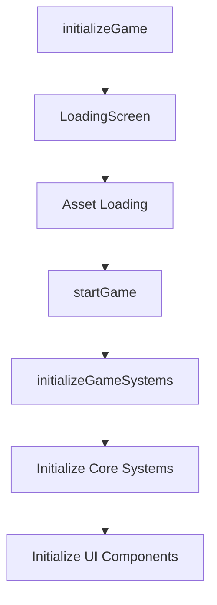
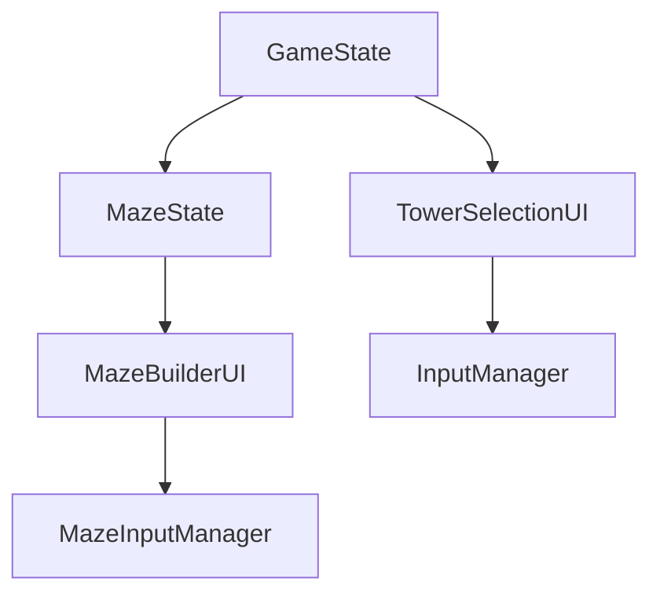
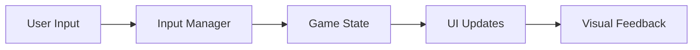
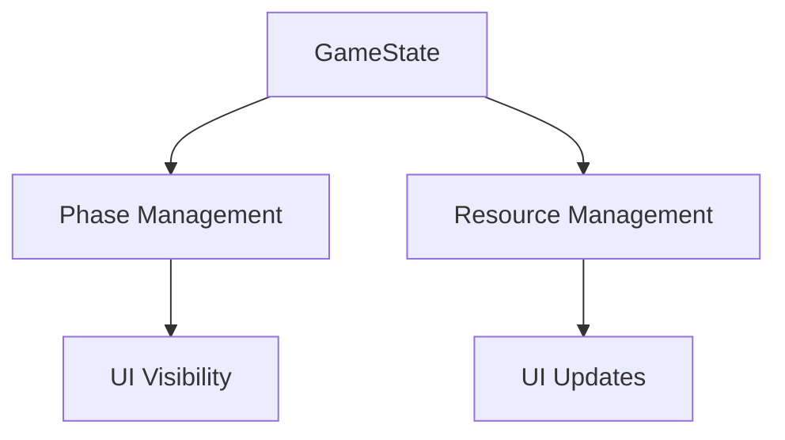

# Tower Defense UI System Documentation

## Overview
This document outlines the UI components and their interactions in the Tower Defense game. The game features a modular UI system with distinct components for different game phases.

## UI Components

### 1. LoadingScreen
The loading screen is the first UI component players see. It provides visual feedback during asset loading.

**Features:**
- Professional loading interface with gradient background
- Progress bar with percentage
- Animated loading dots
- Status text showing current loading asset
- Smooth fade transitions

**Key Interactions:**
```javascript
const loadingScreen = new LoadingScreen();
loadingScreen.show();
await assetManager.preloadEssentialAssets((loaded, total, currentAsset) => {
    loadingScreen.updateProgress(loaded, total, currentAsset);
});
```

### 2. MazeBuilderUI
Interface for the maze building phase where players create the tower defense layout.

**Features:**
- Fixed panel on right side
- Shape preview display
- Remaining shapes counter
- Control instructions
- Start Defense button
- Strategic placement guidance

**Controls:**
- T key: Pick up next shape
- R key: Rotate shape
- Click: Place shape

### 3. TowerSelectionUI
Interface for the tower defense phase where players place and manage towers.

**Features:**
- Grid-based tower selection
- Tower information tooltips
- Affordability indicators
- Interactive tower slots
- Resource-based availability

## Component Connections

### Initialization Flow


### Component Hierarchy


### Input Management Chain


### State Management Flow


## Phase Transitions

### Maze Building to Defense Phase
```javascript
function startDefensePhase() {
    // Hide maze builder UI
    mazeBuilderUI.hide();
    
    // Show tower selection UI
    towerSelectionUI.show();
    
    // Switch input managers
    mazeInputManager.cleanup();
    initializeTowerInput();
}
```

## Component Communication

### Callback System
Components communicate through a callback system to maintain loose coupling:

```javascript
// Tower Selection to Input Manager
towerSelectionUI.setOnTowerSelectedCallback((towerData) => {
    inputManager.setSelectedTowerData(towerData);
});

// Input Manager to Tower Selection
inputManager.setOnTowerMenuUpdateCallback(() => {
    towerSelectionUI.updateTowerMenu();
});
```

## Architecture Benefits

1. **Modularity**
   - Each UI component is independently maintainable
   - Clear separation of concerns
   - Easy to extend or modify individual components

2. **State Management**
   - Centralized game state
   - Consistent state propagation
   - Clear update patterns

3. **Input Handling**
   - Phase-specific input management
   - Clean transition between game phases
   - Proper event cleanup

4. **Visual Consistency**
   - Coordinated visual feedback
   - Smooth transitions between states
   - Professional appearance

5. **Maintainability**
   - Well-defined component boundaries
   - Clear communication patterns
   - Documented interaction flows

## Best Practices

1. **State Updates**
   - Always propagate through GameState
   - Use callbacks for cross-component communication
   - Maintain single source of truth

2. **Input Management**
   - Clear input handler ownership
   - Proper cleanup on phase transitions
   - Prevent input conflicts

3. **Visual Feedback**
   - Immediate response to user actions
   - Clear state indication
   - Smooth transitions

4. **Error Handling**
   - Graceful fallbacks
   - Clear error messages
   - Recovery mechanisms

## Future Considerations

1. **Extensibility**
   - New UI component integration
   - Additional game phases
   - Enhanced visual feedback

2. **Performance**
   - Efficient state updates
   - Optimized rendering
   - Resource management

3. **Accessibility**
   - Keyboard navigation
   - Screen reader support
   - Color contrast compliance 